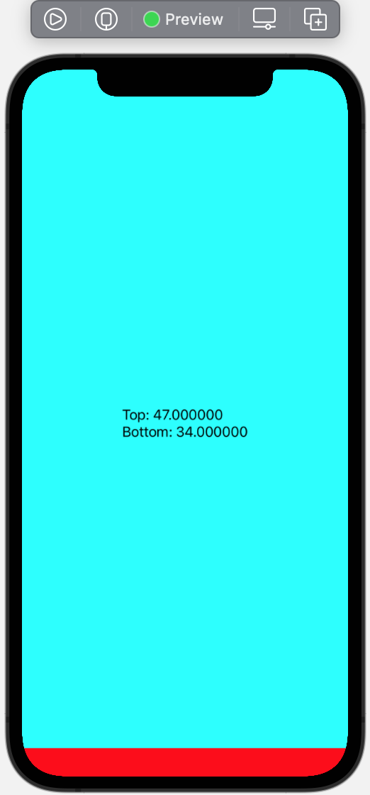
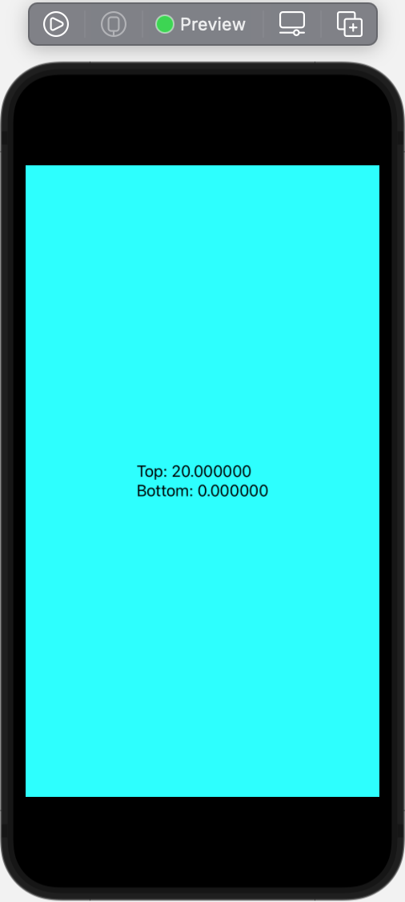

# SwiftUI Demos

There are 3 demo:

1. Safe area simple: SafeAreaInsetsViewSecond demonstrates another approach to set the full screen background, but child will respect the safe area. 

2. Safe area full control:  we know how to  expand any view to fill the screen area with .ignoreSafeArea() modifier.
But how to make child view to respect the safe area in case if parent ignores safe area?
GeometryReader is the answer. We have to use safe area insets from GeometryReader.
Starting from iPhoneX safe area insets are different to the old iPhones.
This demo shows how to position the content in your app according to safe area.

3. PositionReader: use of modifier with KeyPreference for each view, demonstrates how child views can provide data to the root view. In this example we get the CGRect of child and translate it to root view and display.

Usage:
KeyPreference
GeometryReader
NavigationView
List
NavigationLink
